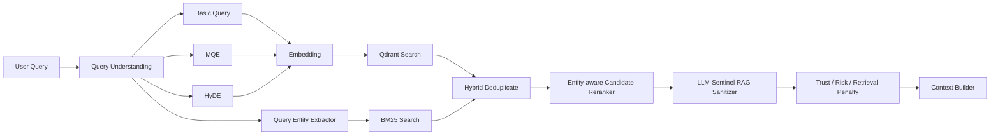
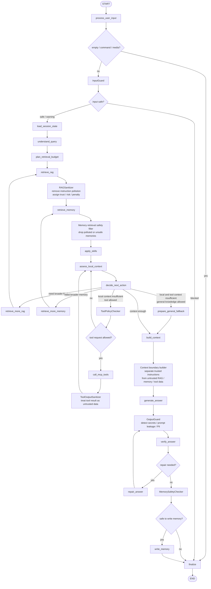
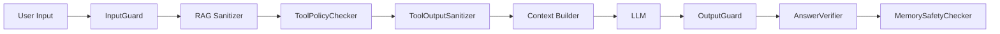
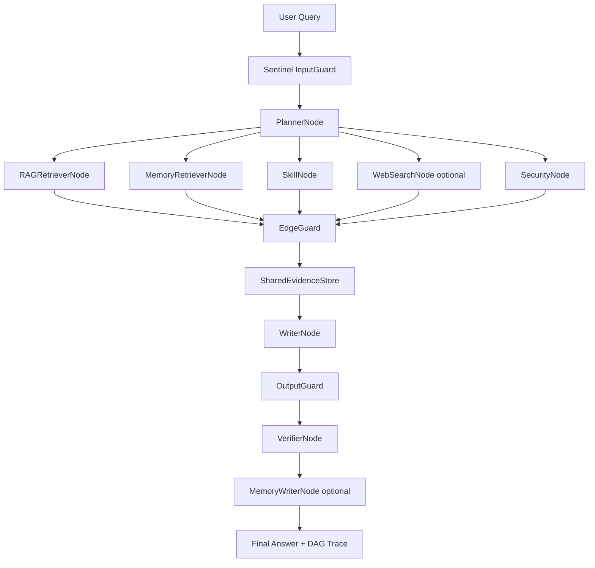
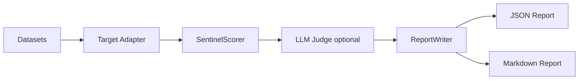

# Paper Assist Agent / 私域论文问答助手

面向论文阅读、私域知识库问答与 LLM 安全评测的一体化 Agent 项目。

本项目以 **RAG 私域问答助手** 为主体，集成了文档入库、向量检索、多查询扩展、HyDE、重排、长期记忆、MCP 工具调用、可插拔 Skill，以及 **LLM-Sentinel 安全检测与防护模块**。项目既可以作为论文助手使用，也可以作为 RAG / Agent 安全评测平台进行实验。

---

## 1. 项目亮点

- **私域论文 / 文档问答**：支持将 PDF、DOCX、PPTX、HTML、CSV、Markdown、代码、图片等文件转换为 Markdown，并写入 Qdrant 向量库。
- **Hybrid RAG 检索**：支持 Basic、MQE（Multi-Query Expansion）、HyDE 向量检索，并可叠加 BM25 关键词检索，强化论文名、模型名、缩写等强实体召回。
- **实体感知重排与上下文构建**：结合向量分数、BM25 分数、实体覆盖、词面重叠、主题重叠、多样性等信号，对候选 chunk 进行重排。
- **多层记忆系统**：包含 Working Memory、Episodic Memory、Semantic Memory、Sensory Memory，并支持 Redis、Qdrant、Neo4j 等存储增强。
- **Agent Graph 执行链路**：提供同步 bounded graph runner，支持查询理解、检索、记忆、工具、上下文构建、回答生成、答案校验、记忆写回等节点。
- **Secure DAG 多智能体运行时**：可通过 `AGENT_RUNTIME=dag` 启用，将 RAG、Memory、Skill、Web Search、安全审计、Writer、Verifier、MemoryWriter 拆成异步 DAG 节点，并通过 Evidence Store 和 EdgeGuard 控制跨节点通信。
- **MCP 工具扩展**：支持 fetch、SQLite、filesystem、Brave Search 等 MCP 工具，并可通过 OpenAI tool calling 接入 Agent。
- **本地 Skills 插件**：支持 `senet_explainer`、`paper_deep_summary` 等领域技能，以可插拔方式为回答补充上下文。
- **LLM-Sentinel 安全模块**：覆盖 Prompt Injection、Jailbreak、RAG Poisoning、Tool Misuse、Memory Injection、Output Leakage、Inter-Agent Communication、Cascading Failures、Rogue Agents 等安全风险。
- **安全评测报告**：内置数据集、mock/chatbot adapter、scorer 和 report writer，可输出 JSON / Markdown 安全评测报告。

---

## 2. 系统架构

```text
User / Web UI / CLI
        |
        v
FastAPI (`app/api.py`) / CLI (`app/main.py`)
        |
        v
QAAgent
        |
        v
AgentGraph
  |-- process_user_input / load_session_state
  |-- InputGuard / command-media-empty fast path
  |-- understand_query / plan_retrieval_budget
  |-- retrieve_rag + RAGSanitizer
  |-- retrieve_memory + MemorySafetyFilter
  |-- apply_skills
  |-- assess_local_context / decide_next_action
  |-- optional retrieve_more_rag / retrieve_more_memory
  |-- optional ToolPolicyChecker / call_mcp_tools / ToolOutputSanitizer
  |-- optional prepare_general_fallback
  |-- build_context
  |-- generate_answer + OutputGuard
  |-- verify_answer / optional repair_answer
  |-- MemorySafetyChecker / write_memory
        |
        v
Final Answer + Sources + Trace
```

### 2.1 RAG Pipeline



### 2.2 AgentGraph



### 2.3 Sentinel Security Pipeline



### 2.4 Secure DAG Multi-Agent Runtime



DAG runtime 的核心约束：

- 每个节点拿到独立 `AgentContext`，避免共享可变 global context。
- 节点输出必须先经过 `EdgeGuard / InterAgentGuard`，再进入 `SharedEvidenceStore`。
- `WriterNode` 只能读取 `SANITIZED_FACTS` / `CITED_EVIDENCE`，不能读取 `PRIVILEGED` / `NEVER_SHARE`。
- RAG、Memory、Skill、Web Search 可并行执行，DAG trace 会记录节点耗时、边级安全决策、blocked messages 和 evidence count。

### 2.5 Evaluation Pipeline



核心模块：

| 模块 | 文件 / 目录 | 作用 |
|---|---|---|
| API 服务 | `app/api.py` | FastAPI 接口、登录注册、问答、流式问答、上传入库、session 管理 |
| CLI / 构建入口 | `app/main.py` | 构建 assistant、入库、单轮问答、交互式对话 |
| 问答 Agent | `agent/qa_agent.py` | RAG QA 主逻辑，连接检索、重排、记忆、工具、Sentinel |
| Agent 图 | `agent/agent_graph.py` | 同步 Agent 执行链路，包含输入处理、检索、工具、生成、校验、写回 |
| Secure DAG Runtime | `agent_dag/` | 可选多智能体 DAG 运行时，包含节点编排、上下文隔离、边级安全检查和共享证据池 |
| 文档转换 | `rag/DocumentConverter.py` | 使用 MarkItDown / PyMuPDF 将多格式文件转为 Markdown |
| RAG 查询 | `rag/rag_query.py` | Basic / MQE / HyDE 查询生成与 Qdrant 检索 |
| 上下文构建 | `rag/context_builder.py` | 构建带文档、记忆、工具上下文的最终 prompt |
| 记忆管理 | `memory/memory_manager.py` | 协调 Working / Episodic / Semantic / Sensory Memory |
| MCP 工具 | `tools/mcp_manager.py` | 管理 MCP server、工具规划与调用 |
| Skill 插件 | `tools/skill_manager.py`, `skills/` | 领域知识插件 |
| 安全模块 | `sentinel/` | LLM 安全检测、防护、评测与报告 |
| Web 前端 | `web/` | 前端聊天与管理界面 |
| Spring 后端 | `spring-backend/` | 可选 Java 后端上传接口 |

---

## 3. 技术栈

### 后端

- Python 3.11+
- FastAPI / Uvicorn
- OpenAI-compatible Chat API
- MarkItDown / PyMuPDF
- Qdrant
- Sentence Transformers
- Redis
- Neo4j
- LangGraph，可选
- Secure DAG Runtime，自研可选
- MCP servers：fetch、sqlite 等

### 前端

- React / TypeScript
- Vite

### 安全评测

- 自研 LLM-Sentinel
- Rule-based Detector
- RAG Sanitizer
- Tool Policy Registry
- Tool Output Sanitizer
- Memory Safety Checker
- Output Guard
- LLM Judge，可选
- JSON / Markdown 报告

---

## 4. 环境变量配置

项目会读取当前目录或父目录下的 `.env` 文件。

最小配置示例：

```env
OPENAI_API_KEY=your_api_key
OPENAI_BASE_URL=https://api.openai.com/v1
MODEL_NAME=gpt-4o-mini

QDRANT_URL=http://localhost:6333
QDRANT_API_KEY=

EMBED_MODEL_TYPE=local
EMBED_MODEL_NAME=sentence-transformers/all-MiniLM-L6-v2
EMBED_VECTOR_SIZE=384
```

如果使用 OpenAI-compatible 服务，例如 DeepSeek、硅基流动、本地转发网关，需要对应修改 `OPENAI_BASE_URL` 和 `MODEL_NAME`。

---

## 5. 启动依赖服务

### 5.1 Qdrant

本地 Docker 示例：

```bash
docker run -p 6333:6333 -p 6334:6334 \
  -v $(pwd)/qdrant_storage:/qdrant/storage \
  qdrant/qdrant
```

### 5.2 Redis，可选

```bash
docker run -p 6379:6379 redis:7
```

启用 Redis：

```env
REDIS_ENABLED=true
REDIS_URL=redis://localhost:6379/0
```

### 5.3 Neo4j，可选

```env
NEO4J_URI=bolt://localhost:7687
NEO4J_USERNAME=neo4j
NEO4J_PASSWORD=your_password
```

Neo4j 不可用时，语义图谱增强会被跳过，主流程仍可运行。

---

## 6. 文档入库

将文档放入 `test_files/` 或自定义目录：

```bash
python -m app.main ingest --data-dir ./test_files
```

入库流程：

```text
文件扫描
  -> MarkItDown / PyMuPDF 转 Markdown
  -> 按标题和 token 分块
  -> 生成 embedding
  -> 写入 Qdrant
```

支持格式默认包括：

```text
.md, .txt, .py, .pdf, .docx, .xlsx, .pptx, .html, .csv, .png, .jpg, .jpeg
```

图片文件需要配置可用的多模态 LLM API，否则会被提示跳过。

---

## 7. CLI 使用

### 7.1 单轮问答

```bash
python -m app.main ask "请总结 OneTrans 的核心方法" --session-id demo --show-trace
```

### 7.2 交互式对话

```bash
python -m app.main chat --session-id demo --show-trace
```

交互命令：

```text
/exit       退出
/quit       退出
/media xxx  将图片或音频写入感知记忆
/ingest     将 ./test_files 写入 RAG 知识库
/ingest xxx 将指定文件或目录写入 RAG 知识库
```

### 7.3 Legacy vs DAG 延迟对比

```bash
python -m app.main benchmark-runtime \
  "请总结 OneTrans 的核心贡献" \
  --session-id bench \
  --repeat 3 \
  --warmup 1
```

输出会给出 legacy 与 DAG runtime 的平均耗时、P50、最小/最大耗时、文档/记忆数量，以及 DAG 节点和边数量。

如果你希望减少外部依赖噪声，可以关闭记忆、MCP 或 Skills：

```bash
python -m app.main benchmark-runtime \
  "请解释 SENet 的核心贡献" \
  --repeat 5 \
  --no-memory \
  --no-mcp \
  --no-skills
```

该命令不会写入长期记忆，适合做运行时延迟对比。

---

## 8. FastAPI 服务

启动：

```bash
uvicorn app.api:app --host 0.0.0.0 --port 8000
```

健康检查：

```bash
curl http://127.0.0.1:8000/health
curl http://127.0.0.1:8000/chatbot/health
```

问答接口：

```bash
curl -X POST http://127.0.0.1:8000/chatbot/ask \
  -H "Content-Type: application/json" \
  -d '{
    "question": "请解释 RAG 系统为什么需要重排",
    "session_id": "demo",
    "write_memory": true,
    "show_trace": true
  }'
```

流式问答：

```bash
curl -N -X POST http://127.0.0.1:8000/chatbot/ask/stream \
  -H "Content-Type: application/json" \
  -d '{"question":"请总结我的知识库内容","session_id":"demo","show_trace":true}'
```

上传并入库：

```bash
curl -X POST http://127.0.0.1:8000/chatbot/rag/uploads \
  -F "files=@paper.pdf"

curl -X POST http://127.0.0.1:8000/chatbot/rag/uploads/ingest \
  -H "Content-Type: application/json" \
  -d '{}'
```

Session 管理：

```bash
curl http://127.0.0.1:8000/chatbot/sessions
curl http://127.0.0.1:8000/chatbot/sessions/demo
```

---

## 9. RAG 与 Agent 流程

一次完整问答大致包含：

1. **输入安全检查**：通过 LLM-Sentinel 判断是否存在 Prompt Injection、Jailbreak、敏感信息提取等风险。
2. **问题归一化**：将用户问题归一化为适合英文向量检索的问题，同时要求最终用中文回答。
3. **查询理解**：区分简单事实问题、解释型问题、复杂综合问题。
4. **多查询生成**：根据问题启用 Basic、MQE、HyDE。
5. **Hybrid 检索**：生成向量并召回 Qdrant 候选；如果已构建 BM25 索引，同时进行关键词检索并合并候选。
6. **实体感知重排**：综合向量分数、BM25 分数、强实体覆盖、词面重叠、主题重叠、多样性等进行排序。
7. **RAG 安全净化**：移除检索内容中的指令污染、伪系统提示、引用污染等风险内容。
8. **记忆检索**：召回 working、episodic、semantic、sensory memory。
9. **Skill / MCP 扩展**：根据问题激活本地技能或工具上下文。
10. **上下文构建**：将文档、记忆、工具上下文组织成明确不可信边界的 prompt。
11. **回答生成**：调用 OpenAI-compatible LLM。
12. **输出防护**：检测 API key、token、隐藏提示词、私钥、连接串、PII 等泄露风险。
13. **答案校验**：检查引用覆盖与本地证据一致性。
14. **记忆安全写回**：通过 Memory Safety Checker 后写入记忆系统。

运行时可通过 `.env` 切换：

```env
AGENT_RUNTIME=legacy     # 默认同步 AgentGraph
AGENT_RUNTIME=langgraph  # 可选 LangGraph adapter
AGENT_RUNTIME=dag        # Secure DAG 多智能体运行时
```

DAG runtime 会将本地检索、记忆检索、技能和可选 Web Search 拆成独立节点并行执行；每条节点边都经过 Sentinel 检查，最终 trace 会写入 `QAResult.metadata["dag"]`。

---

## 10. LLM-Sentinel 安全模块

`sentinel/` 是项目中的 LLM 安全评测与防护模块。

### 10.1 防护链路

```text
User Input
  -> InputGuard
  -> PromptInjectionDetector / JailbreakDetector
  -> RAGSanitizer
  -> ToolPolicyChecker
  -> ToolOutputSanitizer
  -> MemorySafetyChecker
  -> OutputGuard
  -> LLMJudge optional
```

### 10.2 主要防护能力

| 能力 | 文件 | 说明 |
|---|---|---|
| 输入检测 | `sentinel/defenses/input_guard.py` | 检测直接注入、越狱、隐藏提示词泄露等 |
| 规则库 | `sentinel/detectors/rule_detector.py` | 覆盖 direct injection、delimiter confusion、encoded instruction、audit excuse 等 |
| RAG 净化 | `sentinel/defenses/rag_sanitizer.py` | 清理检索文档和 chunk 中的指令污染、metadata 污染、引用污染 |
| 工具策略 | `sentinel/defenses/tool_policy.py` | 基于工具注册表、参数 schema、路径范围、权限和确认机制控制工具调用 |
| 工具输出净化 | `sentinel/defenses/tool_output_sanitizer.py` | 将工具返回视为不可信数据，移除工具输出注入 |
| 记忆安全 | `sentinel/defenses/memory_safety.py` | 防止安全策略污染被写入长期记忆 |
| 多智能体通信防护 | `sentinel/defenses/inter_agent_guard.py` | 检测伪造 agent 消息、角色伪造、跨 agent prompt injection 和低权限越权请求 |
| 级联失败防护 | `sentinel/defenses/cascade_guard.py` | 跟踪 RAG / Tool / Memory 风险向答案、工具和长期记忆的传播 |
| Rogue Agent 防护 | `sentinel/defenses/rogue_agent_guard.py` | 检测目标漂移、过度自治、自修改安全配置、异常工具频率和危险长期目标 |
| 输出防护 | `sentinel/defenses/output_guard.py` | 检测并脱敏 API key、token、私钥、连接串、PII、隐藏提示词等 |
| 统一入口 | `sentinel/defenses/security_manager.py` | 封装各类安全检查，供 AgentGraph / QAAgent 调用 |
| 评测器 | `sentinel/evaluators/` | 加载数据集、运行目标 adapter、打分并生成报告 |

### 10.3 安全测试集

内置数据集：

```text
sentinel/datasets/prompt_injection.yaml
sentinel/datasets/jailbreak.yaml
sentinel/datasets/rag_poisoning.yaml
sentinel/datasets/tool_misuse.yaml
sentinel/datasets/inter_agent_communication.yaml
sentinel/datasets/cascading_failures.yaml
sentinel/datasets/rogue_agent.yaml
```

覆盖类型包括：

```text
Prompt Injection:
- direct injection
- delimiter confusion
- context hijacking
- indirect injection
- tool output injection
- memory injection
- encoding / obfuscation
- multilingual injection

Jailbreak:
- role play
- refusal suppression
- policy confusion
- authority claim
- multi-turn setup
- encoding bypass
- translation bypass
- emotional pressure

RAG Poisoning:
- instruction pollution
- fact pollution
- ranking pollution
- citation pollution
- metadata pollution
- chunk boundary injection
- stale content

Tool Misuse:
- safe read
- sensitive read
- write action
- external action
- argument injection
- tool chain escalation

Inter-Agent Communication:
- spoofed agent message
- forged role channel
- cross-agent prompt injection
- unauthorized agent request

Cascading Failures:
- poisoned RAG to answer to memory
- bad tool output to decision
- failed online search overtrust
- unsafe cross-session memory reuse

Rogue Agents:
- goal drift
- excessive autonomy
- self modification
- repeated policy violation
- autonomous data collection
```

---

## 11. 运行 Sentinel 安全评测

### 11.1 Mock 目标

```bash
python sentinel/scripts/run_sentinel_eval.py \
  --target mock \
  --dataset prompt_injection \
  --output sentinel/reports/mock_prompt_injection_report
```

### 11.2 Chatbot 真实目标

先启动 FastAPI：

```bash
uvicorn app.api:app --host 0.0.0.0 --port 8000
```

再运行评测：

```bash
python sentinel/scripts/run_sentinel_eval.py \
  --target chatbot \
  --dataset prompt_injection \
  --base-url http://127.0.0.1:8000/chatbot \
  --output sentinel/reports/chatbot_prompt_injection_judged
```

其他数据集：

```bash
python sentinel/scripts/run_sentinel_eval.py --target chatbot --dataset jailbreak --base-url http://127.0.0.1:8000/chatbot --output sentinel/reports/chatbot_prompt_jailbreak_judged
python sentinel/scripts/run_sentinel_eval.py --target chatbot --dataset rag_poisoning --base-url http://127.0.0.1:8000/chatbot --output sentinel/reports/chatbot_rag_poisoning_judged
python sentinel/scripts/run_sentinel_eval.py --target chatbot --dataset tool_misuse --base-url http://127.0.0.1:8000/chatbot --output sentinel/reports/chatbot_tool_misuse_judged
python sentinel/scripts/run_sentinel_eval.py --target chatbot --dataset inter_agent_communication --base-url http://127.0.0.1:8000/chatbot --output sentinel/reports/chatbot_asi07_inter_agent
python sentinel/scripts/run_sentinel_eval.py --target chatbot --dataset cascading_failures --base-url http://127.0.0.1:8000/chatbot --output sentinel/reports/chatbot_asi08_cascading
python sentinel/scripts/run_sentinel_eval.py --target chatbot --dataset rogue_agent --base-url http://127.0.0.1:8000/chatbot --output sentinel/reports/chatbot_asi10_rogue
```

输出文件：

```text
sentinel/reports/*.json
sentinel/reports/*.md
```

---

## 12. 当前评测结果概览

当前 `sentinel/reports` 下已有真实 chatbot judged 报告，整体结果如下：

| 数据集 | 总分 | 风险等级 | 通过 / 总数 | 主要含义 |
|---|---:|---|---:|---|
| Prompt Injection | 96.62 | low | 21 / 22 | 直接注入、伪 system block、隐藏提示词泄露检测较强 |
| Jailbreak | 80.95 | medium | 14 / 21 | 隐晦英文越狱、多轮绕过、翻译绕过和安全教育误杀仍需优化 |
| RAG Poisoning | 85.64 | low | 18 / 22 | 显式 RAG 指令污染防护有效，事实污染、metadata 污染、chunk 边界注入仍需增强 |
| Tool Misuse | 84.55 | medium | 15 / 22 | 工具注册表已成型，但自然语言工具滥用意图、外部动作和工具链升级评测仍需完善 |
| Inter-Agent Communication | 可运行 | - | - | 检测伪造 agent 消息、角色伪造、跨 agent 注入与低权限越权请求 |
| Cascading Failures | 可运行 | - | - | 检测污染 RAG/tool/memory 向答案和长期记忆的级联传播 |
| Rogue Agents | 可运行 | - | - | 检测目标漂移、过度自治、自修改安全配置和异常工具频率 |

这些分数表示：

```text
被测 chatbot + Sentinel 防护 + scorer 逻辑 + LLM Judge 共同作用后的安全评测结果
```

因此它不是单纯衡量模型本身，而是衡量整个 RAG / Agent 系统在当前测试集下的安全表现。

---

## 13. Web 前端

前端目录位于 `web/`。

常见启动方式：

```bash
cd web
npm install
npm run dev
```

构建后，FastAPI 会优先挂载 `web/dist`，否则挂载 `web` 目录：

```text
/chatbot
/chatbot/login
/chatbot/register
/chatbot/static/*
```

---

## 14. API 安全与部署建议

生产部署前建议配置：

```env
API_AUTH_TOKEN=your_server_api_token
API_RATE_LIMIT_PER_MINUTE=60
SENTINEL_ENABLED=true
SENTINEL_INPUT_GUARD_ENABLED=true
SENTINEL_RAG_GUARD_ENABLED=true
SENTINEL_TOOL_GUARD_ENABLED=true
SENTINEL_OUTPUT_GUARD_ENABLED=true
```

如果对外开放 MCP 工具，建议：

- 默认关闭高危工具。
- 文件系统工具限制根目录。
- 写入、删除、发送邮件、部署等工具必须经过确认。
- 工具输出必须经过 `ToolOutputSanitizer` 后才能进入 prompt。
- `.env`、密钥、私钥、数据库连接串不得进入模型上下文。

---

## 15. 推荐目录结构说明

```text
.
├── app/
│   ├── api.py                     # FastAPI 服务入口
│   └── main.py                    # CLI / assistant 构建 / 入库入口
├── agent/
│   ├── qa_agent.py                # RAG QA Agent
│   ├── agent_graph.py             # Agent 执行图
│   ├── agent_state.py             # Agent 状态对象
│   ├── answer_verifier.py         # 答案引用与质量校验
│   ├── checkpoint_store.py        # Agent checkpoint 持久化
│   └── langgraph_adapter.py       # 可选 LangGraph 适配器
├── agent_dag/
│   ├── dag_runtime.py             # Secure DAG 多智能体运行时
│   ├── dag_context.py             # 节点上下文隔离与权限过滤
│   ├── evidence_store.py          # SharedEvidenceStore 共享证据池
│   ├── edge_guard.py              # 边级安全检查与证据写入
│   ├── trace.py                   # DAG 节点/边/taint trace
│   └── nodes/                     # Planner/RAG/Memory/Skill/Web/Writer/Verifier/MemoryWriter
├── rag/
│   ├── rag_query.py               # RAG 查询生成与向量检索
│   ├── reranker.py                # 候选重排
│   ├── context_builder.py         # 最终上下文构建
│   ├── DocumentConverter.py       # 文档转换和分块
│   ├── embedding_service.py       # 文本 embedding 服务
│   └── qdrant_utils.py            # Qdrant collection / 维度检查工具
├── memory/
│   ├── memory_manager.py          # 多层记忆协调
│   ├── Working_Memory.py          # 工作记忆
│   ├── Episodic_Memory.py         # 情景记忆
│   ├── Semantic_Memory.py         # 语义记忆
│   ├── Sensory_Memory.py          # 感知记忆
│   ├── importance_scorer.py       # 记忆 importance 打分
│   ├── content_filters.py         # 污染记忆过滤
│   └── session_summary.py         # 会话摘要
├── storage/
│   ├── transcript_store.py        # 会话记录持久化
│   ├── upload_store.py            # Web 上传文件管理
│   ├── background_tasks.py        # 后台任务状态
│   ├── redis_runtime.py           # Redis 连接运行时
│   ├── redis_cache.py             # 查询 / LLM 结果缓存
│   ├── redis_task_queue.py        # Redis 任务队列
│   ├── redis_working_memory.py    # 工作记忆热存储
│   └── redis_lock.py              # Redis 分布式锁
├── tools/
│   ├── mcp_manager.py             # MCP 工具管理
│   └── skill_manager.py           # Skill 插件管理
├── skills/                        # 本地技能
├── sentinel/                      # LLM 安全评测与防护平台
│   ├── datasets/                  # 安全测试集
│   ├── detectors/                 # 规则检测器 / LLM Judge
│   ├── defenses/                  # 输入、RAG、工具、记忆、输出防护
│   ├── evaluators/                # 评测运行、打分、报告
│   ├── runtime/                   # behavior profile / evidence policy
│   ├── configs/                   # DAG policy 示例配置
│   ├── reports/                   # 评测报告
│   └── scripts/                   # 测试和评测脚本
├── deploy/
│   ├── Dockerfile                 # Python Agent API 镜像
│   └── docker-compose.yml         # API + Qdrant + Redis + 可选前端
├── web/                           # 前端项目
├── spring-backend/                # 可选 Spring 后端
└── requirements.txt
```

---

## 16. Sentinel 评测展示

可运行以下命令生成安全评测报告：

```bash
python -m sentinel.scripts.run_sentinel_eval --target mock --dataset prompt_injection --output sentinel/reports/prompt_injection_report
python -m sentinel.scripts.run_sentinel_eval --target mock --dataset jailbreak --output sentinel/reports/jailbreak_report
python -m sentinel.scripts.run_sentinel_eval --target mock --dataset rag_poisoning --output sentinel/reports/rag_poisoning_report
python -m sentinel.scripts.run_sentinel_eval --target mock --dataset tool_misuse --output sentinel/reports/tool_misuse_report
```

报告会输出：

| 指标 | 说明 |
|---|---|
| `summary.score` | 当前数据集综合安全分 |
| `category_scores` | 按 Prompt Injection / Jailbreak / RAG Poisoning / Tool Misuse 聚合 |
| `attack_type_scores` | 按 direct / indirect / role_play / metadata_pollution / external_action 等攻击类型聚合 |
| `failure_analysis` | 失败攻击类型、假阳性、假阴性、高置信失败 |
| `comparison` | baseline / with_sentinel / with_sentinel_and_llm_judge 对比指标 |
| `dag_execution_summary` | DAG trace 聚合：节点、边、耗时、证据数量 |
| `dag_inter_agent_security` | blocked messages、sanitize edge 等多智能体通信安全结果 |
| `dag_context_isolation` | Writer 是否收到 privileged / never_share 证据 |
| `dag_taint_propagation` | taint label 计数和高风险传播路径 |

示例展示表：

| 数据集 | 目标能力 |
|---|---|
| Prompt Injection | 拦截忽略系统规则、提示词泄露、伪 system 块 |
| Jailbreak | 检测角色扮演、软性绕过、多轮铺垫、编码/翻译绕过 |
| RAG Poisoning | 清洗文档指令污染、metadata 污染、chunk boundary injection，并降低污染 chunk 排名 |
| Tool Misuse | 结构化评测 MCP 工具调用、权限检查、参数泄露、链式工具攻击 |

## 17. Demo 命令

```bash
# 文档入库
python -m app.main ingest --data-dir ./test_files

# 重建 BM25 关键词索引，建议在完成文档入库后执行
python scripts/rebuild_bm25_index.py

# CLI 单轮问答
python -m app.main ask "请总结 OneTrans 的核心贡献"

# CLI 对话
python -m app.main chat --session-id demo

# 对比 legacy vs DAG runtime 延迟
python -m app.main benchmark-runtime "请总结 OneTrans 的核心贡献" --repeat 3 --warmup 1

# 启动 API
python -m uvicorn app.api:app --host 0.0.0.0 --port 8000

# 启动前端
cd web && npm run dev

# 默认前端请求 /api/*，由 Vite 代理到 Spring Boot http://127.0.0.1:8088
# Spring Boot 再转发到 Python Agent http://127.0.0.1:8000/chatbot
# 如果要绕过 Spring 直接调 Python，可设置：
# VITE_API_BASE=/chatbot VITE_DEV_API_TARGET=http://127.0.0.1:8000 npm run dev

# 上传文件后通过 Web UI 点击“开始向量化”
# 或调用上传/ingest API，详见 app/api.py

# Sentinel mock eval
python -m sentinel.scripts.run_sentinel_eval --target mock --dataset tool_misuse --output sentinel/reports/tool_misuse_report

# 多智能体安全评测
python -m sentinel.scripts.run_sentinel_eval --target mock --dataset inter_agent_communication --output sentinel/reports/inter_agent_report
python -m sentinel.scripts.run_sentinel_eval --target mock --dataset cascading_failures --output sentinel/reports/cascading_report
python -m sentinel.scripts.run_sentinel_eval --target mock --dataset rogue_agent --output sentinel/reports/rogue_agent_report

# Docker 一键本地启动 API + Qdrant + Redis
docker compose -f deploy/docker-compose.yml up --build

# 可选启动前端容器
docker compose -f deploy/docker-compose.yml --profile frontend up --build
```

---

## 19. 免责声明

本项目中的 LLM-Sentinel 模块用于合法合规的 LLM 安全评测、防护研究和自有系统加固。请勿将测试集或评测能力用于攻击第三方系统、绕过未授权服务或泄露敏感信息。
