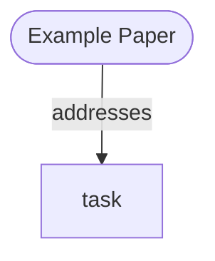

# Paper Tools

This package contains local Python tools for automatic academic paper acquisition, parsing, graphing, and Markdown note generation.

## Tools

| Tool | Purpose |
|---|---|
| `paper_search_tool` | Search paper metadata and open-access PDF availability through free APIs. |
| `paper_pdf_reader_tool` | Read PDF text from a remote PDF URL or local PDF path. |
| `paper_parser_tool` | Parse paper text/PDF into metadata, sections, references, and RAG-ready chunks. |
| `paper_knowledge_graph_tool` | Generate a Mermaid knowledge graph and save it as a renderable Markdown file. |
| `paper_summary_tool` | Generate and save a detailed Markdown paper-summary note. |

## Registration

Use the local registry when exposing these tools to an Agent, FastAPI route, or OpenAI-compatible tool calling layer.

```python
from tools.paper_tools import get_paper_tool, list_paper_tools

schemas = list_paper_tools()
search = get_paper_tool("paper_search_tool")
result = search(query="retrieval augmented generation", limit=5)
```

For OpenAI-compatible function tool specs:

```python
from tools.paper_tools.registry import as_openai_tools

openai_tools = as_openai_tools()
```

## Missing PDF behavior

Free APIs cannot guarantee that every target paper has an accessible PDF. The search tool therefore never silently drops missing PDFs by default.

Default behavior:

```python
paper_search_tool(
    query="example paper",
    require_pdf=True,
    missing_pdf_policy="include_and_mark",
)
```

When a PDF cannot be found, the result includes:

```json
{
  "pdf_access": {
    "status": "missing",
    "pdf_url": null,
    "message": "No open access PDF was found from the configured free APIs. Manual upload is required."
  },
  "processing_status": "pdf_missing"
}
```

The top-level response also contains `missing_pdf_papers`, which can be displayed in the final LLM answer or a frontend upload queue.

## Typical workflow

```python
from tools.paper_tools import get_paper_tool

search = get_paper_tool("paper_search_tool")
reader = get_paper_tool("paper_pdf_reader_tool")
parser = get_paper_tool("paper_parser_tool")
summary = get_paper_tool("paper_summary_tool")
graph = get_paper_tool("paper_knowledge_graph_tool")

search_result = search(query="RAG survey", limit=3)
for paper in search_result["data"]["papers"]:
    if paper["pdf_access"]["status"] != "available":
        print("Manual upload required:", paper["title"])
        continue

    read_result = reader(
        pdf_source=paper["pdf_url"],
        source_type="url",
        paper_metadata=paper,
    )
    parse_result = parser(
        input_source=read_result["data"]["local_path"],
        input_type="local_pdf",
        paper_metadata=paper,
        output_format="json",
    )
    summary_result = summary(
        paper_metadata=paper,
        content=read_result["data"]["text"],
        use_llm=False,
    )
    graph_result = graph(
        paper_metadata=paper,
        sections=parse_result["data"]["sections"],
        summary_markdown=summary_result["data"]["summary_markdown"],
    )
```

## Mermaid knowledge graph

`paper_knowledge_graph_tool` saves Markdown such as:

```md
# 🧠 Example Paper 知识图谱


```

Use it in Markdown environments that support Mermaid, including GitHub and many documentation systems.

## Markdown summary note

`paper_summary_tool` preserves the ideas of the original Zotero HTML template but writes Markdown:

- paper metadata table,
- abstract block,
- 研究核心,
- Insight & Novelty,
- Potential Limitations & Research Gaps,
- 数据 / 方法 / 实验 / 结论,
- first-principles Motivation,
- personal note section.

By default, `use_llm=False`, so the tool creates a detailed fillable Markdown template. Set `use_llm=True` to call an OpenAI-compatible model. API keys must be supplied through environment variables, for example:

```bash
export OPENAI_API_KEY="..."
export OPENAI_BASE_URL="https://api.example.com/v1"
export MODEL_NAME="gpt-4o-mini"
```

Do not hard-code API keys in source code or generated templates.

## Notes

- `paper_search_tool` currently supports Crossref, OpenAlex, Unpaywall, and arXiv in the MVP implementation.
- `pubmed_central`, `europe_pmc`, and `core` remain in the schema for future expansion.
- `paper_parser_tool` defaults to a lightweight local parser. The schema is already prepared for future GROBID or Unstructured backends.
- `paper_knowledge_graph_tool` emits Mermaid inside a Markdown code block so it can render directly.
- `paper_summary_tool` can generate either a structured Markdown template or an LLM-filled summary.
- For Unpaywall enrichment, set `UNPAYWALL_EMAIL` in `.env` or pass `email=...` at call time.
